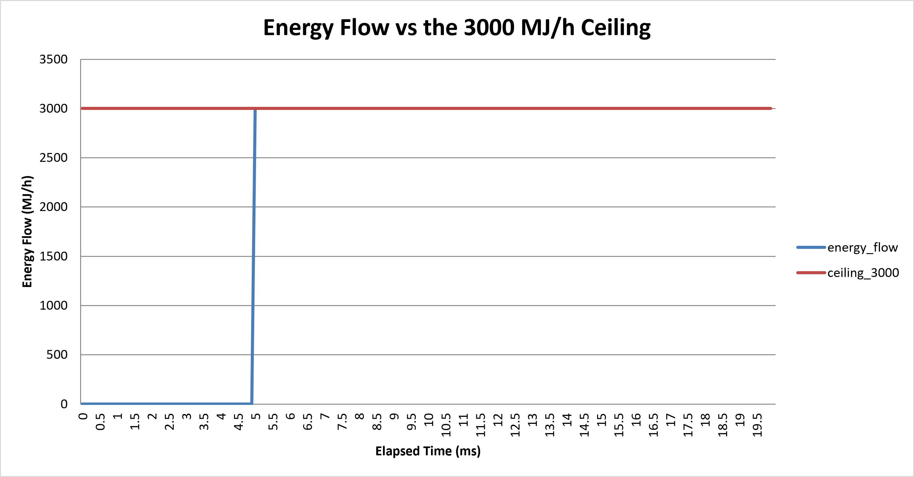
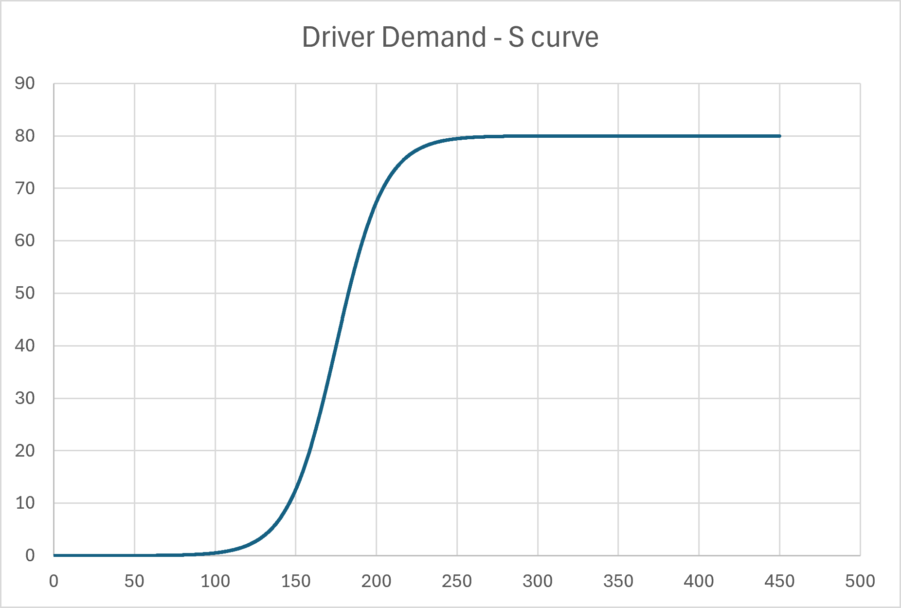
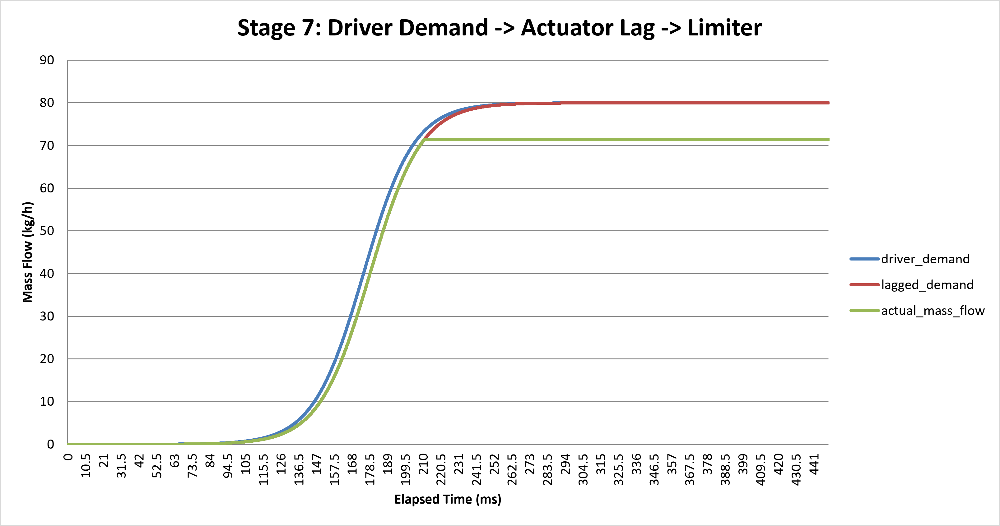
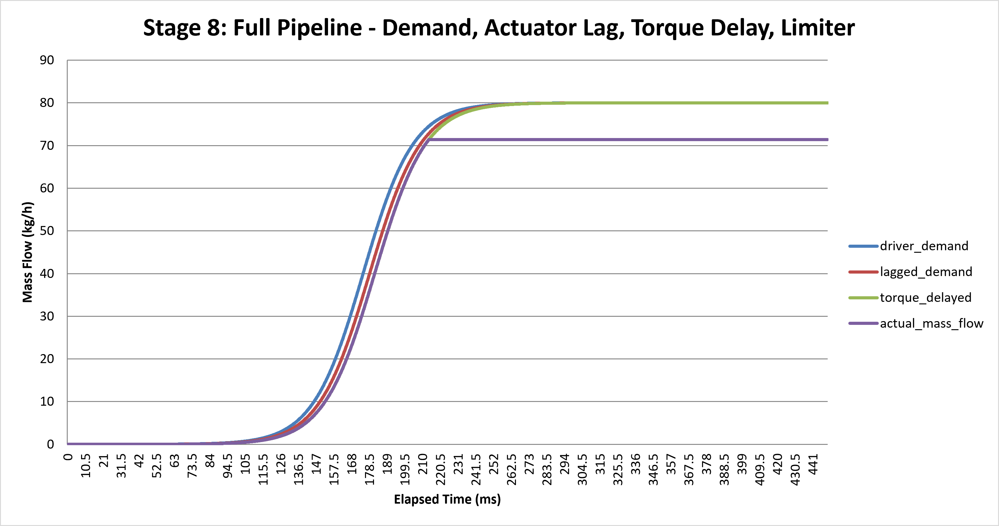
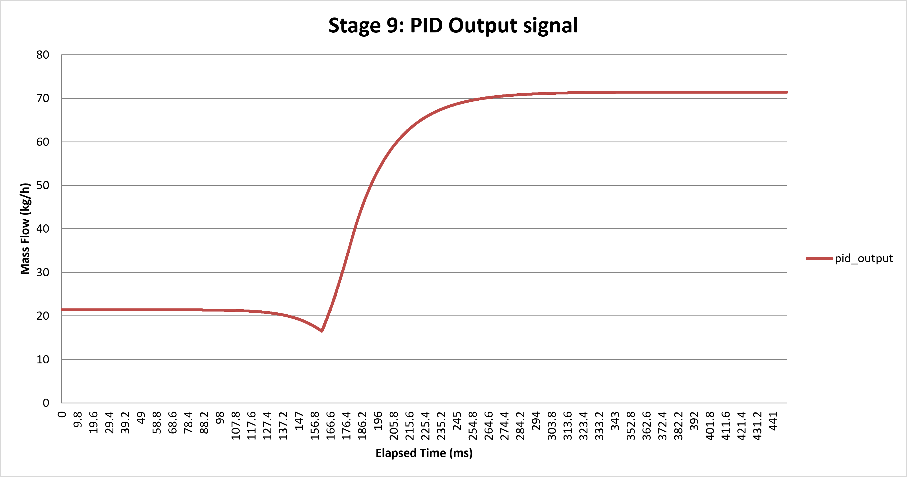
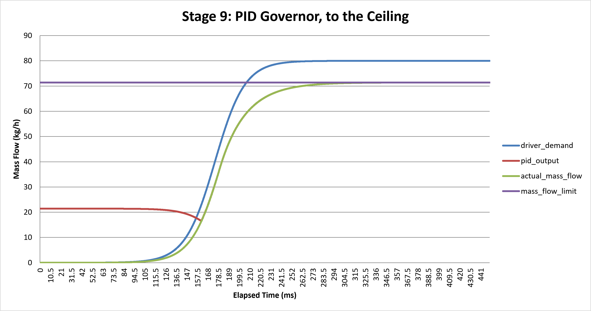

# Fuel Flow Limiter Control System (C)

Simulated real-time fuel flow limiting control system, modelling a
constraint used in Formula 1 power units — including limiter control
logic, data logging, and controller tuning analysis.

## Overview

From 2026, F1 replaced the traditional mass-based fuel flow limit
(100 kg/h) with a maximum **energy** flow rate limit of 3,000 MJ/h
(roughly equivalent to 70 kg/h of fuel, depending on energy density).
This shift aligns with the introduction of 100% advanced sustainable
fuels and a roughly 50-50 power split between internal combustion and
electrical energy — it stops fuel suppliers being penalised for using
sustainable blends with different energy densities, while ensuring
every team gets equivalent performance regardless of fuel choice.

The 3,000 MJ/h cap applies at high engine speeds. At lower RPM, a
separate formula limits energy flow to control low-speed acceleration
and corner-exit traction:

```
Maximum Allowed Energy Flow (MJ/h) = 0.27 × Engine RPM + 165   
```

- At 10,500 RPM, this formula would allow ~4,000 MJ/h, but the hard
  3,000 MJ/h cap overrides it.
- Below 6,790 RPM, allowed energy flow scales linearly with engine
  speed.

Teams are also limited to 2,700 MJ total energy consumption per race.
There's no longer a strict fuel volume/weight limit — only the energy
cap — though fuel must maintain a minimum density of 720 kg/m³ to
prevent ultra-light, hyper-volatile chemical mixtures.


## Problem Statement

Modern F1 power units are restricted to a maximum fuel energy flow
rate (3,000 MJ/h). Exceeding this limit is illegal and gives a direct
power advantage; staying meaningfully under it wastes available
performance. The real system is a hard ceiling, not a fixed target —
the control problem is to track as close to the limit as possible
without crossing it, using continuously measured actual flow.

Real enforcement measures mass flow directly via a physical sensor and
derives energy flow from it in real time: the FIA uses contactless
ultrasonic Allengra transducers (two separate meters — one for the
team, one encrypted and FIA-only), working on a differential
transit-time principle — timing ultrasonic pulses between transducers
to calculate fluid velocity, with no moving parts to interfere with
flow. The two pipes have deliberately different geometry, making it
mechanically difficult to synchronise the two meters' readings. Even
if the sensor fails, flow can still be estimated indirectly from fuel
pressure and injector timing, though less accurately.


The controller must keep energy flow rate (derived from mass flow ×
fuel energy density) below the ceiling, while getting as close to it
as possible. Since energy density varies slightly batch-to-batch, the
actual mass flow rate corresponding to the limit isn't fixed — it
depends on which fuel is loaded.

**Sources:**
- https://www.auto123.com/en/news/f1-technique-formula-1-fuel-flow-sensor-explained/36019/
- https://scuderiafans.com/f1-how-the-new-2026-fuel-flow-meter-works-and-why-it-matters/

## Design Decisions

- **Limiter, not setpoint** — the controller tracks a ceiling, not a
  fixed target, matching how the real system works.
- **Energy flow, not mass flow** — `energy_flow = mass_flow ×
  energy_density`, with the ceiling check applied to the derived
  energy flow.
- **Energy density** — fixed constant for now; modelling batch-to-batch
  variation is a stretch goal, not core scope.
- **Data types** — `double` throughout, for precision over many future
  loop iterations.
- **Comparison convention** — `energy_flow − ceiling`; a negative
  result means safely under the limit, positive means a violation.

## Stage 0: Single Time-Step Calculation

**Inputs:** mass flow (kg/h), energy density (MJ/kg), energy flow
ceiling (3,000 MJ/h).

**Calculation:** derive energy flow from mass flow × energy density,
then compare against the ceiling.

**Assumptions at this stage** 
- No time dimension — single snapshot, no loop yet.
- Fixed, hardcoded inputs.
- Instantaneous, lag-free conversion — no sensor delay, noise, or
  measurement error modelled.
- No actuator or control input yet.
- Energy density treated as a single fixed constant.
- No unit conversion complexity (all values already in per-hour terms).

**Sanity check:** 70 kg/h × 42 MJ/kg = 2,940 MJ/h → −60 MJ/h vs.
ceiling (safely under). Matches `src/stage0.c` output.

See `src/stage0.c` for the implementation.

## Stage 1: Plant Simulation Loop

**Goal:** run the Stage 0 calculation repeatedly over simulated
time, with mass flow changing, and no control logic
yet to prove that an uncontrolled system can violate the ceiling.

**Driving scenario research:** real mass flow drops close to 0 kg/h
under braking or coasting and rises sharply under full throttle. All
teams run the same FIA-mandated standard ECU, giving a uniform,
near-instant throttle response (~10-15 ms). A physically detailed
model of that response (driver input delay, first-order actuator lag,
torque dead time) was researched and is documented for a future
refinement, but is **not yet implemented at stage 1** 

**Time step and duration:** `dt = 0.1 ms`, run for 200 iterations
(20 ms total simulated time). Mass flow is 0 kg/h for the first 5 ms
(simulating coasting e.g releasing pedal before a break zone to reserve fuel), then steps to a fixed high value at the 5 ms mark for the remaining 15 ms.

**Step-change value — deliberately unrealistic, and labelled as
such:** the real 2026 target mass flow (~70 kg/h) does *not* violate
the ceiling on its own (70 × 42 = 2,940 MJ/h) so it can't demonstrate a failure by
itself. Stage 1 instead uses **80 kg/h**, a value chosen specifically
showing that a mass flow rate  too high leads to a ceiling violation, which will be addressed in stage 2.

**Assumptions at this stage:**
- Mass flow changes as an instant step, not a physically modelled
  transition (see driving scenario research above).
- Still no actuator or controller — mass flow is set directly by
  the scenario, not by any control logic.
- Energy density remains a fixed constant for the rest of the project, since energy density is roughly constant within a single race/fuel batch
- 80 kg/h is a deliberate stress-test value

**Result:** confirms the uncontrolled failure mode. Before the
step (mass flow = 0), `ceiling_comparison = −3000 MJ/h` (safely under).
After the step (mass flow = 80 kg/h), `energy_flow = 3,360 MJ/h` and
`ceiling_comparison = +360 MJ/h`  sustained ceiling
violation with nothing to correct it, which is what Stage 2's
controller needs to prevent.

See `src/stage1.c` for the implementation.

## Stage 2: Fuel Limiter (Min-Select Control Logic)

**Goal:** add a controller that prevents the ceiling violation Stage 1 demonstrated, by capping the mass flow that's actually used rather than letting driver demand pass through.

**Variable change:** Renamed mass_flow to driver_demand, so the signature itself makes clear it's the pre-limit requested value from the drive pressing the pedal.

**Architecture research:** real engine control uses a "min-select" (low-select) pattern: the ECU compares driver demand (driver_demand) against a regulatory limit (mass_flow_limit) and always uses whichever is lower: final_mass_flow = min(driver_demand, regulatory_limit).

**Implementation: apply_fuel_limiter(driver_demand, mass_flow_limit) function,  takes both values as parameters rather than reading a constant internally, so it doesn't depend on anything outside its own inputs. This makes it testable and reusable (e.g. with a different limit later, without changing the function itself).

**Simplification:** mass_flow_limit here is the flat 3,000 MJ/h ceiling converted to a mass flow value (CEILING / ENERGY_DENSITY), not the real RPM-dependent regulatory limit from the Overview section above (yet, see Stretch Goals below.)

**Result:** before the step, unchanged from Stage 1 (ceiling_comparison = −3000 MJ/h). After the step, driver demand is still 80 kg/h, but actual_mass_flow is capped at 71.428571 kg/h, giving energy_flow = 3,000 MJ/h exactly and ceiling_comparison = 0 MJ/h - zero violation.

**floating point precision:** mass_flow_limit is derived by division and then multiplied back, floating-point in C rounding could produce a tiny non-zero result (e.g. 1e-10) instead of exactly 0, even with no real violation. Worth using a small tolerance rather than a strict > 0  later.

**Stretch goals:**
- Dynamic driver demand — currently a hardcoded step (0 → 80 kg/h at 5ms). Making this a flexible test scenario (different demand shapes, ramps, multiple runs) is deferred to Stage 3
- User-input fuel compounds via scanf — would let different teams' energy density values be tested interactively. Deferred because it would reopen the "energy density is a fixed constant for the whole project" design decision, which should be a deliberate revision
- RPM-dependent regulatory limit and air-density- limited flow (from atmospheric intake pressure regulations, FIA Article 5.5.2) both deferred until the core controller architecture above is solid.

See `src/stage2.c` for the implementation.

## Stage 3: Structs — Test Scenarios and Team Fuel Profiles
 
**Goal:** replace the driver demand step and the fixed energy density  with structured, and in
the fuel case, user-supplied data, using structures for the first
time.
 
**Test scenario struct:** `struct test_scenario1` holds
`before_value`, `after_value`, `step_time`, and `name` (a driving
scenario label). One instance, `scenario`, replaces Stage 1/2's
hardcoded `0`/`80`/`5` step values directly, the loop's `if`/`else`
now reads `scenario.before_value`, `scenario.after_value`, and
`scenario.step_time` instead of bare numbers.
 
**Team fuel struct and dynamic input:** `struct team` holds
`name` and `fuel_energy_density`, filled interactively via `scanf` at
the start of `main`. This removed the `#define ENERGY_DENSITY 42.0`
constant. Every place that previously referenced `ENERGY_DENSITY` (`mass_flow_limit`
calculation, `energy_flow` calculation) now reads
`team.fuel_energy_density` instead.
 
**Result:** running with real input (e.g. team name "Ferrari",
fuel energy density 42.0) reproduces exactly the same output as
Stage 2's  version — `ceiling_comparison` still lands at
`0 MJ/h` after the step. 
 

**Stretch goal, newly added: PID with feedback.** A PID
controller could sit alongside (not replace) the current min-select
limiter the hard limiter retained underneath as a safety backstop. Deferred. this is planned *after* Stage 4 (CSV logging/plotting), since PID's actual benefits (smooth response vs. a hard
step) are best demonstrated visually once plotting exists.

The intended architecture is a cascade: PID computes a desired mass flow each iteration from feedback error, and that value is passed straight into the existing, unchanged apply_fuel_limiter from Stage 2. Under normal operation the limiter should rarely engage, since a well-tuned PID stays under the ceiling on its own. The  challenge is integral windup: if PID's output is clamped by the limiter, PID itself has no knowledge of that and keeps accumulating integral error against a target it's not actually reaching, causing overshoot or sluggish response once conditions change. Solving this requires anti-windup — feeding the limiter's clamping action back to the PID rather than letting the two controllers run blind to each other.
 
See `src/stage3.c` for the implementation.

## Stage 4: CSV Logging

**Goal:** write every iteration's results to a CSV file instead of
only printing to the console, producing a dataset that can 
be plotted.
 
**Columns:** `elapsed_time, driver_demand, actual_mass_flow,
energy_flow, ceiling_comparison, mass_flow_limit`. `mass_flow_limit`
is repeated on every row (it's constant) specifically so it can be
plotted as a horizontal reference line without needing a separate
file or manual entry at plot time.
 
**File I/O structure:** `fopen("results.csv", "w")` and the
header-row `fprintf` both happen once, before the loop starts. The `NULL` check on `fopen`'s return value is included, since a failed file open would otherwise crash later with a confusing error rather than a clear one. A second `fprintf(pF,...)` call, using comma-separated `%f` values, sits inside the loop alongside the existing console `printf` writing one row per iteration. `fclose(pF)` runs once, after the loop ends.
 
 
**Result:** running the program produces a 201-line CSV (1 header
+ 200 data rows) 

Plotting `driver_demand`, `actual_mass_flow`, and `mass_flow_limit`
against `elapsed_time` shows `actual_mass_flow` tracking demand
exactly, then flattening precisely at the limit the instant it's
reached, while `driver_demand` keeps rising past it 

 A second plot of `energy_flow`
against the 3,000 MJ/h ceiling shows the same result in the
regulation's own units: energy flow rises then sits exactly flat at
3,000,.
See `src/stage4.c` for the implementation.

## Stage 5: Comparison, Verification, and Write-Up

Goal: bring the uncontrolled and controlled results into a single, directly comparable dataset.

Uncontrolled comparison column: Stage 1 proved the failure mode existed, Stage 5 adds uncontrolled_energy_flow = driver_demand ×  team.fuel_energy_density, it represents "what would have happened with no controller."

Quantified result: across the 149 iterations after the step (80 kg/h demanded), uncontrolled_energy_flow holds steady at 3,360 MJ/h, energy_flow, the real controlled result, never exceeds 3,000 MJ/h on any iteration. Plotting both against elapsed_time on the same chart shows this directly.




See src/stage5.c for the implementation.

## Stage 6: Driver Input Delay (Sigmoid Transition)

**Goal:** replace the instant driver-demand step with a physically
motivated transition, giving the plant imperfection for a
future feedback controller to correct against.

**note on scope:** the original research (Stage 1) described
this stage as "a ramp function mimicking human foot speed". The S-curve (sigmoid) used here is a deliberate refinement, reasoned from how human muscle movement actually accelerates and decelerates rather than moving at constant speed.

**Formula:**

```
driver_demand(t) = before_value + (after_value − before_value) / (1 + e^(−k(t − t_mid)))
```

This is a first-order step-response equation,it models the throttle responding gradually to a driver's demand, rather than instantly reaching it.

| Term           | F1 interpretation                                      |
| -------------- | ------------------------------------------------------ |
| `before_value` | Driver's fuel demand **before** the change             |
| `after_value`  | Driver's fuel demand **after** the change              |
| `t`            | Time                                                   |
| `t_mid`        | Time at which the change is **half complete**          |
| `k`            | How **quickly/aggressively** the driver changes demand |
| `e`            | Euler's number ≈ 2.718                                 |


Implemented directly, with no `if`/`else` branching: a
sigmoid naturally settles near `before_value` long before `t_mid` and
near `after_value` long after it, so no explicit "before/during/after"
condition is needed the way the old instant step required.

**Parameter derivation:**
- `t_mid = 175ms` — the centre of a 150ms transition window that
  starts at 100ms (100 + 75).
- `k ≈ 0.067` — derived from the sigmoid's active region spanning
  roughly `±5/k`; setting that equal to the desired ±75ms half-width
  gives `k = 5/75 ≈ 0.067`.
- Total simulated duration increased from 200 to 4,500 iterations
  (20ms → 450ms), to fit 100ms settling before the transition, the
  150ms transition itself, and 200ms settling after — the old 20ms
  window couldn't contain a transition this wide.

**New practical requirement:** `#include <math.h>` for `exp()`.
Some systems (Linux/older GCC) require an explicit `-lm` linker flag
(`gcc stage6.c -o stage6 -lm`) or the compile fails with `undefined
reference to 'exp'`; not needed on this project's Windows/MinGW setup.

**Result, verified at key checkpoints:** `driver_demand` sits near 0
at t=0, hits exactly 40 (the true halfway point) at t=175ms
confirming the formula, and approaches 80 by the end of the run.
`actual_mass_flow` follows the same S-curve until it reaches
`mass_flow_limit` (~71.4), at which point it flattens early while
`driver_demand` keeps rising toward 80 — the limiter now visibly
intervening partway through a gradual, physically-motivated rise
rather than at an instant step.

**Known simplification:** `t_mid` is currently a single hardcoded
struct value (175), rather than derived from separate
`before_duration`/`transition_duration` fields that would show the
reasoning behind that number directly in code. Deferred as a minor
refactor, not a correctness issue — the value itself has been
manually verified against the derivation above.


See `src/stage6.c` for the implementation.



## Stage 7: Actuator Lag (Discrete First-Order Filter)

**Goal:** model the fuel system's physical inability to instantly
match driver demand (the actuator lag stage from the original
multi-stage research) giving the plant a second source of
imperfection on top of Stage 6's sigmoid curve.

- Renamed the limiter's parameter from `driver_demand` to `requested_mass_flow` once Stage 7 began feeding it lagged_demand instead

Originally, I had found a researched formula, `Actual Throttle(t) = Driver
Demand(t) × (1 − e^(−t/τ))`, 

| Term                 | Meaning                                                          |
| -------------------- | ---------------------------------------------------------------- |
| `Driver Demand(t)`   | What throttle level the driver is requesting                     |
| `Actual Throttle(t)` | What the engine/throttle actually achieves                       |
| `t`                  | Time since the throttle command/step began                       |
| `τ`                  | **Time constant** — determines how quickly the throttle responds |
| \(1-e^{-t/\tau}\)    | The response of a first-order system                             |


but it assumes demand is a step at t=0. Since
Stage 6 replaced the step with a continuously-changing sigmoid, that
formula no longer applies as-is. Instead, this stage uses a discrete
first-order lag filter, recalculated every iteration from its own
previous value:

```
lagged_demand = lagged_demand + (dt / tau) × (driver_demand − lagged_demand)
```

| Term                            | Meaning                                                 |
| ------------------------------- | ------------------------------------------------------------------------------ |
| `lagged_demand`                 | The current fuel demand after accounting for the response lag                  |
| `dt`                            | The simulation time step — the amount of time between each calculation         |
| `tau`                           | The time constant — determines how quickly `lagged_demand` responds to changes |
| `driver_demand`                 | The fuel demand requested by the driver, calculated from the sigmoid curve     |
| `driver_demand − lagged_demand` | The difference between what the driver wants and the current lagged demand     |
| `dt / tau`                      | The proportion of this difference applied during each timestep                 |


- every prior value (elapsed_time, driver_demand, energy_flow) was
recalculated fresh each iteration with no memory of the past.
`lagged_demand` is different: it's initialised once, before the loop
(`lagged_demand = scenario.before_value;`), then updated in place
each iteration, reading its own prior value on the right-hand side
before being overwritten. 

**Pipeline, updated:** `driver_demand` (sigmoid) → `lagged_demand`
(actuator lag, this stage) → `apply_fuel_limiter` (unchanged from
Stage 2) → `actual_mass_flow`. The limiter now acts on `lagged_demand`,
not raw `driver_demand`.



<mark>**`tau` value:** no official FIA
figure exists for actuator response time. `tau ≈ 4ms` is used, will likely change in the future with more research.</mark>


**Result, verified at t = t_mid (175ms):** `driver_demand = 40.0`
(exactly halfway, confirming the sigmoid is unaffected), while
`actual_mass_flow = 34.94` shows it is trailing behind, not matching
instantly. By t = 250ms the limiter engages and `actual_mass_flow`
flattens at ~71.4, same as every prior stage from that point on.

**Note on `uncontrolled_energy_flow`'s meaning shifting:**
this column still uses raw `driver_demand` (per its Stage 5
definition), so from this stage onward it represents "no limiter *and*
no actuator lag" — a slightly different baseline than before, since
actuator lag now sits between demand and the limiter for the
*controlled* result. 

See `src/stage7.c` for the implementation.

## Stage 8: Torque Delay (Fixed-Duration Buffer)

**Goal:** model the remaining piece of the multi-stage
lag chain: time between the actuator reaching a position and
that actually producing engine torque (air travel, fuel mixing,
combustion, mechanical force transfer).

**Actuator lag vs. torque delay difference:**

| | Actuator lag (Stage 7) | Torque delay (Stage 8) |
|---|---|---|
| **What it represents** | The fuel system physically catching up to what's being commanded | time taken for Air travel to pass, mixing, combustion, and mechanical force transfer, once the actuator/valve has ALREADY moved/opened.|
| **Effect on the signal** | *Reshapes* it: smooths and slows the approach toward a target | *Shifts* it: same values, just later in time |
| **Mechanism** | single running variable, nudged a fraction of the way toward the target each iteration | A 30-slot buffer, storing and replaying past values unchanged |


**In short:** `torque_delayed` right now is exactly `lagged_demand` from
3ms ago, a pure time-shift stacked *after* actuator lag
has already reshaped the signal. 

**Why this needed arrays** a true dead-time delay must recall a specific past
value (`lagged_demand` from exactly N iterations ago), which a single
variable cannot do. This required a fixed-size buffer (`double buffer[30]`).

**Mechanism — a shift register, three steps per iteration, in a
specific order:**
```c
torque_delayed = buffer[29];              /* 1. read the oldest, before it's overwritten */

for (i = 29; i > 0; i--) {
    buffer[i] = buffer[i - 1];            /* 2. shift every value one slot older */
}
buffer[0] = lagged_demand;                /* 3. write today's value into the newest slot */
```
Order matters: reading before shifting/writing prevents the oldest
value from being overwritten before it's captured.

**Buffer size:** 30 slots, from 3ms (the midpoint of the researched
2-5ms torque delay range) ÷ 0.1ms.


**Result:** `torque_delayed` at t=175ms exactly equals
`lagged_demand` at t=172ms (31.098859 both times),
confirming the delay is precise. The full pipeline
is now `driver_demand` → `lagged_demand` → `torque_delayed` →
`apply_fuel_limiter` → `actual_mass_flow`.



See `src/stage8.c` for the implementation.

## Stage 9: PID Governor with Min-Select and Anti-Windup

**Goal:** replace the static hard ceiling with a smooth, anticipatory
controller that tracks the ceiling continuously, while keeping the
original min-select (choose the lower value) architecture and hard limiter intact 
it as a safety backstop.

**Architecture:** PID computes a candidate mass flow each iteration
from feedback error (`mass_flow_limit − previous_actual_mass_flow`),
kept in mass flow units throughout for consistency with the rest of
the controller chain. This candidate
competes against `torque_delayed` via `apply_fuel_limiter`, since it's just "return whichever value is smaller,"
regardless of what's being compared. The result of that comparison
is then passed through `apply_fuel_limiter` a second time against the
static `mass_flow_limit`, as a hard backstop against
overshoot from bad tuning or edge cases.

**Anti-windup:** the integral term only accumulates when PID's own
output is the one winning the min-select
(`pid_output <= torque_delayed`), otherwise it's frozen. Without
this, the integral would grow unboundedly whenever driver demand is
comfortably under the ceiling (which is most of the time), since
error stays positive the whole time even though PID isn't influencing
the output at all.

**The tuning process:**

| Attempt | Gains | Result |
|---|---|---|
| 1 | Kp=1.0, Ki=0.01, Kd=0 | Stable, but never converges, still 63kg/h short of the ceiling after 450ms |
| 2 | Kp=3.0, Ki=0.1, Kd=0 | Unstable, bouncing between two extremes every single iteration |
| 3 | Kp=1.5, Ki=0.05, Kd=0.5 | adding derivative amplified the oscillation's sharp jumps into a `-inf` overflow ("derivative kick") |
| 4 | **Kp=0.3, Ki=0.05, Kd=0** | **Stable, converges to within 0.001 of the target, zero overshoot** |


**Why `Kd = 0` turned out to be correct:** two
reasons. First, once `Kp` was correctly sized, there was no residual
overshoot left for derivative damping to usefully suppress. Second,
the plant already has built-in smoothing from Stages 7–8 (actuator
lag, torque delay). 

**Result:** `actual_mass_flow` tracks `pid_output` almost exactly
throughout the run, both smoothly converging on `mass_flow_limit`
(71.428 vs. target 71.429) with no oscillation and no overshoot at
any point in the simulation.



**Why `pid_output` dips before converging:** while `torque_delayed`
is still winning the min-select,
`previous_actual_mass_flow` tracks the rising demand from the driver, so
`error = mass_flow_limit − previous_actual_mass_flow` naturally
shrinks. Since anti-windup is correctly freezing `integral`
during this stretch (PID isn't in control yet), `pid_output` is
almost entirely `Kp × error`, so it shrinks right along with the
error. Once `pid_output` finally drops below `torque_delayed`, and becomes the main candidate from min select, PID
takes over, `integral` starts accumulating again, and the curve
turns upward toward the ceiling. .




See `src/stage9.c` for the implementation.